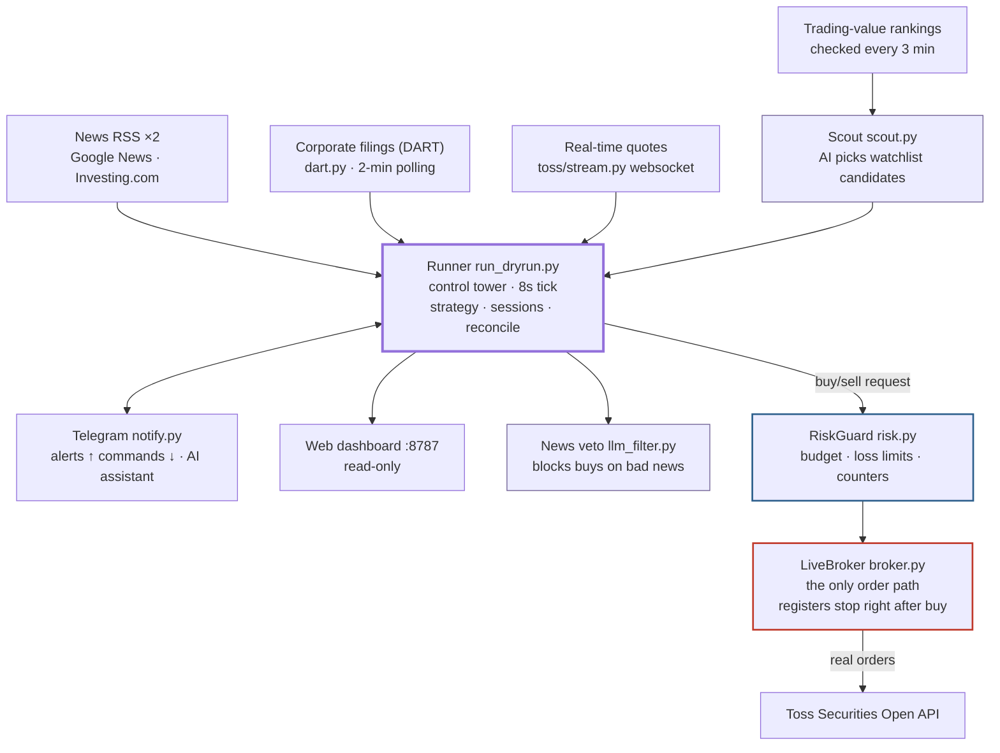

# toss-trader — Small-Capital Auto-Trading Bot for Toss Securities

**🇰🇷 [한국어](README.md)** · 🇺🇸 English


[](https://github.com/cssddd3/trading_bot/discussions/11)
[](https://github.com/cssddd3/trading_bot/issues)

A personal bot that auto-trades Korean (KR) and US stocks with small capital via the
Toss Securities Open API. Runs on your own PC; notifications and remote control via Telegram.

> ## ⚠️ Investment Disclaimer
> This software was built for **personal research and learning**. It guarantees no
> investment returns whatsoever. **All investment losses and outcomes from using this bot
> are entirely your own responsibility.** The author accepts no liability for any
> financial loss arising from its use (MIT License — see [LICENSE](LICENSE)).
> Automated trading can produce unexpected losses from bugs, network failures, or sudden
> market moves. **Only run it with money you can afford to lose**, and never bypass the
> validation gate. Nothing in this document is investment advice.

## Documentation

| Doc | Contents |
|---|---|
| **[Setup Guide](docs/setup.en.md)** | Obtaining the 4 API keys · .env · validation gate · running |
| **[Operation Guide](docs/operation.en.md)** | Telegram commands · web dashboard · budgets · adopting positions |
| **[Strategy Guide](docs/strategy.en.md)** | Live strategies · validation process · rejected strategies |
| [architecture.html](docs/architecture.html) | Visual architecture tour (open in a browser, Korean) |
| [Framework Vision](docs/framework-vision.en.md) | Long-term roadmap — graph-based bot builder (not yet implemented) |
| [CLAUDE.md](CLAUDE.md) | Developer handover context for Claude Code (Korean) |

## Architecture at a Glance



**The path of a single buy** (every gate must pass):

1. **Selection** — trading-value rankings → rule filters (no leveraged ETFs / recent IPOs / warning-flagged stocks) → AI picks watch candidates from that pool only
2. **Buy signal** — only when the strategy's **price rule** fires (news/AI can never generate a buy signal)
3. **Final gates** — RiskGuard limit checks + AI news veto (blocks on bad news)

**Core principle**: AI interprets, rules decide. Only strategies that pass the backtest
validation gate (≥30 out-of-sample trades, positive expectancy, Monte-Carlo loss
probability <30%) may touch real money.

### Safety mechanisms

| Mechanism | What it does |
|---|---|
| Double lock | Real orders require both the `--live` flag and `.env LIVE_TRADING=1` |
| Validation gate | Live mode refuses to start without a passing backtest record |
| Budget cap | Per-market (KR/US) budgets, compounding with realized P&L; extra cash in the account is never touched |
| Existing holdings untouchable | The bot can only sell symbols in its own ledger |
| Exchange-side stops | Stop order registered right after each buy — survives bot death |
| Reconciliation | Ledger vs. account compared at startup + hourly; unexplained mismatch halts trading |
| Kill switch | Telegram `/stop` (pause buys) and `/flat` (liquidate) |
| Single instance | File lock prevents two bots from running at once |

## Quick Start

```bash
git clone https://github.com/cssddd3/trading_bot.git toss-trader && cd toss-trader
pip3 install -r requirements.txt          # Windows: pip
cp .env.example .env                      # fill in keys — see docs/setup.en.md
python3 run_backtest.py -t st --validate  # validation gate (required before live)
./start.sh                                # dry run first (paper fills) — recommended
```

Full walkthrough: **[Setup Guide](docs/setup.en.md)** (includes Windows PowerShell).

## File Map

```
config.py            all settings (budgets/risk/strategy/LLM/stream/scanner)
run_dryrun.py        the runner (dry-run + live share the same code) — --watch loop
run_backtest.py      backtests + --validate gate
broker.py            the only real-order path (LiveBroker + exchange stops)
risk.py              RiskGuard limit checks
scout.py             LLM stock scout / llm_filter.py news veto
news.py              headline collection / dart.py corporate-filings monitor
notify.py            Telegram / tg_assistant.py AI assistant / dashboard.py web dashboard
toss/                API clients (client.py REST / stream.py websocket / auth.py tokens)
strategy/            strategy implementations / backtest/ engine + Monte Carlo
research/            strategy research records (all rejections documented)
```

## Community

- 🗺️ **Roadmap**: [Discussion #11](https://github.com/cssddd3/trading_bot/discussions/11) — evolving into a graph-based bot-builder framework
- 💡 **Strategy ideas & questions**: [Discussions](https://github.com/cssddd3/trading_bot/discussions) — rejected strategies are documented with evidence
- 🐛 **Bugs & suggestions**: [Issues](https://github.com/cssddd3/trading_bot/issues)
- 🤝 **Contributing**: [CONTRIBUTING.md](CONTRIBUTING.md) — the validation gate is the only review standard for strategies

## License

[MIT](LICENSE) — free to use, modify, and distribute, with no warranty of any kind.
All consequences of use, including investment losses, are entirely the user's responsibility.
