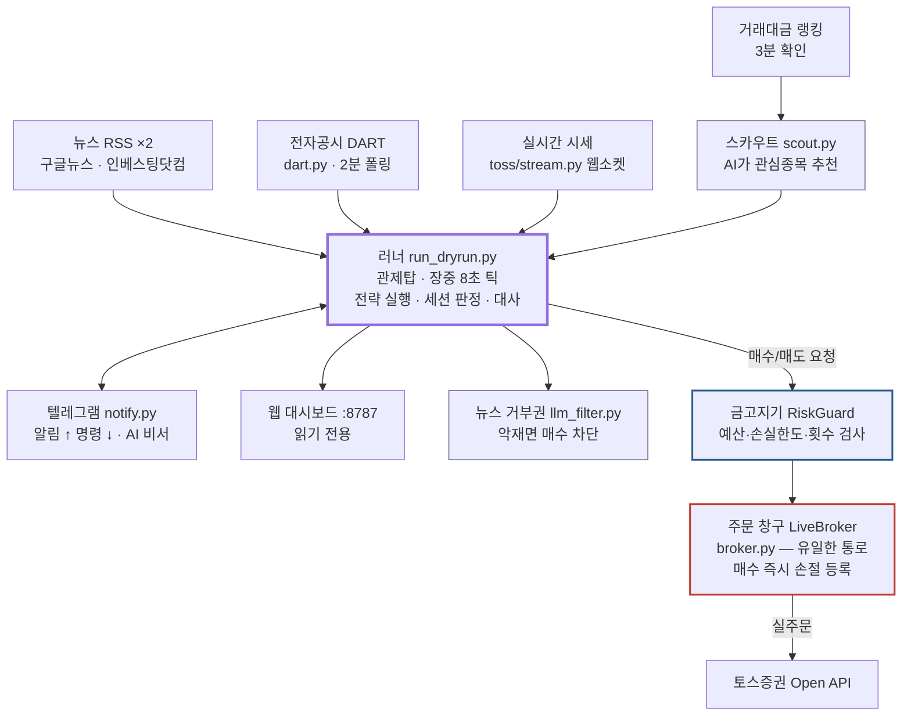

# toss-trader — 토스증권 소액 자동매매 봇

토스증권 Open API로 국내(KR)+미국(US) 주식을 소액으로 자동매매하는 개인용 봇.
사용자 PC에서 돌고, 텔레그램으로 알림/원격제어한다.

> ## ⚠️ 투자 책임 고지 (Disclaimer)
> 이 소프트웨어는 **개인 연구·학습 목적**으로 만들어졌으며, 어떠한 투자 수익도 보장하지
> 않습니다. **이 봇을 사용해 발생하는 모든 투자 손실과 결과는 전적으로 사용자 본인의
> 책임입니다.** 제작자는 이 소프트웨어의 사용으로 인한 어떠한 금전적 손실에 대해서도
> 책임지지 않습니다 (MIT 라이선스 — [LICENSE](LICENSE) 참조).
> 자동매매는 버그·네트워크 장애·시장 급변으로 예상치 못한 손실을 낼 수 있습니다.
> **반드시 잃어도 되는 소액으로만 운용하고**, 검증 게이트를 우회하지 마세요.
> 이 문서의 어떤 내용도 투자 자문이 아닙니다.

## 문서 안내

| 문서 | 내용 |
|---|---|
| **[설치 가이드](docs/setup.md)** | 키 4종 발급 방법 · .env 설정 · 검증 게이트 · 실행 |
| **[운영 가이드](docs/operation.md)** | 텔레그램 명령 · 웹 대시보드 · 예산 · 종목 편입 · 지인 공유 |
| **[전략 가이드](docs/strategy.md)** | 현재 전략 · 검증 절차 · 전환 스캐너 · 기각된 전략들 |
| [architecture.html](docs/architecture.html) | 그림으로 보는 전체 구조 (브라우저로 열기) |
| [CLAUDE.md](CLAUDE.md) | 개발 인수인계 문서 (Claude Code용 컨텍스트) |

## 아키텍처 한눈에



**매수 한 건이 나가는 경로** (전부 통과해야 체결):

1. **종목 선정** — 거래대금 랭킹 → 규칙 필터(레버리지ETF/신규상장/경고종목 제외) → AI가 후보 안에서 관심종목 선택
2. **매수 시그널** — 전략의 **가격 규칙**이 충족될 때만 (뉴스·AI는 매수 시그널을 만들지 못함)
3. **최종 관문** — RiskGuard 한도 검사 + AI 뉴스 거부권 (악재면 차단)

**대원칙**: AI는 해석만, 결정은 규칙. 백테스트 검증 게이트(OOS 30건+, 기대값 양수,
몬테카를로 손실확률 30% 미만)를 통과한 전략만 실돈을 쓴다.

### 안전장치

| 장치 | 내용 |
|---|---|
| 이중 잠금 | `--live` 플래그 + `.env LIVE_TRADING=1` 둘 다 있어야 실주문 |
| 검증 게이트 | 백테스트 통과 기록 없으면 실전 기동 거부 |
| 예산 상한 | 시장별(KR/US) 분리, 실현손익 복리. 계좌에 돈이 더 있어도 초과 사용 불가 |
| 기존 보유 보호 | 봇 장부에 없는 종목은 절대 매도 불가 |
| 거래소측 손절 | 매수 즉시 조건부주문 등록 — 봇이 죽어도 방어선 유지 |
| 대사(reconcile) | 기동 시+1시간마다 장부↔실계좌 비교, 불일치면 매매 정지 |
| 킬 스위치 | 텔레그램 `/stop`(정지) `/flat`(전량청산) |
| 단일 인스턴스 | flock 잠금 — 봇 2개 동시 실행 방지 |

## 빠른 시작

```bash
git clone https://github.com/cssddd3/trading_bot.git toss-trader && cd toss-trader
pip3 install -r requirements.txt
cp .env.example .env            # 키 발급·작성: docs/setup.md 참고
python3 run_backtest.py -t st --validate   # 검증 게이트 (실전 전 필수)
./start.sh                      # 드라이런(가상 체결)으로 먼저 관찰 권장
```

자세한 순서는 **[설치 가이드](docs/setup.md)** 를 따라가면 된다.

## 파일 지도

```
config.py            모든 설정 (예산/리스크/전략/LLM/스트림/스캐너)
run_dryrun.py        러너 (드라이런+실전 공용) — --watch 무한루프
run_backtest.py      백테스트 + --validate 검증 게이트
broker.py            실주문 유일 통로 (LiveBroker + 거래소측 스탑)
risk.py              RiskGuard 한도 검사
scout.py             LLM 종목 스카우트 / llm_filter.py 뉴스 거부권
news.py              헤드라인 수집 / dart.py 전자공시 모니터
notify.py            텔레그램 / tg_assistant.py AI 비서 / dashboard.py 웹 대시보드
toss/                API 클라이언트 (client.py REST / stream.py 웹소켓 / auth.py 토큰)
strategy/            전략 구현 / backtest/ 엔진+몬테카를로 / research/ 전략 연구 기록
```

## 라이선스

[MIT](LICENSE) — 자유롭게 사용·수정·배포 가능하나, 어떠한 보증도 없으며
사용 결과(투자 손실 포함)는 전적으로 사용자 책임입니다.
